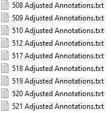

<h1 align="center">SOVT&HRM Data Project</h1>
<p align="center">
 
</p> <br>

**Welcome** to this project! This project contains all of the code necessary to generate the tables and plots used for publication of the manuscript: 
> "Measurement of pharyngeal air pressure during phonation using high-resolution manomtry" <br>
> Hoffmeister, Jesse; Ulmschneider, Christopher; Jones, Corinne; Cuicci, Michelle; McCulloch, Timothy
>
This module was written in **Python** and should be easy to follow with plenty of descriptions of what the code is doing along the way. For further explaination of each module of code, feel free to inspect it for function headers and comments. If you have any questions feel free to contact the author Chris Ulmschneider (ulmschneider.chris@gmail.com)
## Purpose
This project was designed to examine what pressure changes occur in the posterior pharynx during different voicing tasks. This was facilitated using a High-Resolution Manometry (HRM) catheter. This catheter collects pressure data along its length using 36 pressure sensors. It collects data at 100 hertz and therefore generates quite a large data set when recording for several minutes. I built a set of tools `hrmtools` to facilitate analysis of this data. This project uses those tools which are imbedded in this project. They can be found [here](http://github.com/chris-ulmy/hrmtools.git).

## How to use this project
This project is hosted in a Github repository. You must first install the repository into your environment. Run this code in your terminal to download and install this project. It will automatically download any dependencies as well.
```python
pip install git+git://github.com/chris-ulmy/sovt.git@main
```
### Where is the data?
The data is obtained by following the process outlined in the text_files directory markdown file. The code expects the text files to be labeled something like the picture below.
<p align="center">
 
</p>
This is important for determining the subject number programatically. The code expects the files to be labeled as above. 

### Working with the code
Next, import the package into a newly created Python file. The main class module is located in the sovt.py file.
```python
from sovt import SOVT
```
You will need to initialize the SOVT class. You must specify the location of the text files via the `text_path` variable. This is the location where you downloaded the text files. You must also specify the save location via the `save_path` variable which determines the output location of the Excel files and graphs. You can also choose to run a clean run (more explaination on that later) as well as whether or not to generate the graphs (this can be lengthy).
```python
text_path = "C:/users/ulmsc/Documents/SOVT_test/text_files"
save_path = "C:/users/ulmsc/Documents/SOVT_test/outputs"
S = SOVT(text_path, save_path, clean=True, make_plots=True)
S.run()
```
## What the code is doing
This provides a brief overview of what the `run()` function is doing. 
1. The function will load all the data contained in the text_files directory. Each text file will be loaded into a hrm data object.
2. Next a pandas dataframe is created containing the segment information stored in the data sub-class. The data class contains start and stop times for every task for each patient, and also contains the sensor numbers that define each region.
3. Certain segments are ignored for data analysis due to the segment being too short or if there was not adequate concurrent PAS data recording (this data is not included in this project). These segments will be marked as `1` in the "Ignore" column of the dataframe.
4. Mean, median, minimum, maximum, and standard deviation are performed for all segments and each sensor in each region. Additionally, composite calculations are performed across multiple sensors in each region. These are stored in df_ss (single sensor calculations) and df_comp (composite calculations).
5. These data are exported to Excel documents. One version has a multilayer index which can be easier to read via the human eye. A second version of the data is exported with a flattened index to make import to statistical software easier.
6. Graphs are generated for each segment. Both a spatiotemporal plot aross all sensors is plotted, as well as the sensors in each region of interest are plotted as line plots. These are all exported to a graphs directory corresponding to each subject number.
## Saving data
The code is designed to create pickle files for multiple objects stored within the sovt class. This was done to expedite running the code again in the future. If the code detects a pickle file for the corresponding data object exists in the parent directory then it will load data from the pickle file rather than generate the data again. Using the `clean` argument during instantiation of the SOVT object will force the code to create new data objects no matter if it detects the corresponding pickle files or not. If this option needs to be changed after instantiation it can be set as shown below.
```python
S = SOVT(text_path, save_path, clean=True, make_plots=True)
S.clean = False
```